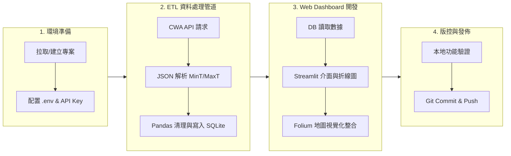

# 🔄 AI 創新微課程：Taiwan Weather Forecast 開發工作流指南 (workflow.md)

> **專案名稱**：AIoT L3 CWA HW1 - Taiwan Weather Forecast  
> **目標**：規範從 API 資料擷取、資料庫維護、Streamlit / Folium Web App 開發到 Git 版本管理的標準作業流程 (SOP)。

---

## 📐 1. 整體開發流程圖 (Overall Workflow)



---

## 🛠️ 2. 開發階段規範與操作 SOP (Phases & SOP)

### 階段一：環境配置與金鑰管理 (Environment & Security)

1. **建立 Python 虛擬環境**：
   ```bash
   python -m venv venv
   # Windows PowerShell 啟用
   .\venv\Scripts\Activate.ps1
   ```
2. **套件安裝**：
   ```bash
   pip install -r requirements.txt
   ```
3. **敏感資訊隔離 (`.env`)**：
   - 建立 `.env` 檔案（切勿 commit 至 Git）：
     ```env
     CWA_API_KEY=CWA-XXXXXXXXXXXXXXXXXXXXXXXX
     CWA_API_URL=https://opendata.cwa.gov.tw/api/v1/rest/datastore/F-C0032-001
     ```
   - 確認 `.gitignore` 包含 `.env`, `data.db`, `venv/`, `__pycache__/` 等規則。

---

### 階段二：ETL 資料處理工作流 (Data Pipeline Workflow)

#### 1. API 擷取與 JSON 結構拆解
- 模組位置：`src/fetch_cwa_data.py`
- 步驟：
  1. 發送 GET 請求帶入 `Authorization` header 獲取 CWA JSON 響應。
  2. 檢查 HTTP Status Code (200 OK)。
  3. 依據 JSON 結構層級提取 `locationName` (區域/縣市名稱) 與 `weatherElement` 中之 `MinT` (最低溫) 與 `MaxT` (最高溫)。

#### 2. Pandas 資料清理與結構化
- 將提取出的欄位整理成 DataFrame 格式：
  | regionName | dataDate | minT | maxT |
  |---|---|---|---|
  | 北部地區 | 2026-04-14 | 18 | 26 |

---

### 階段三：SQLite 資料庫與更新機制 (Database Maintenance)

- 模組位置：`src/db_manager.py`
- 資料庫檔案：`data/data.db`
- **資料表名稱**：`TemperatureForecasts`
- **防重複寫入邏輯 (Idempotency)**：
  - 更新資料庫時，採用 `INSERT OR REPLACE` 或每次定時更新先清除當天及未來舊數據後再寫入，確保多次執行不產生重複死資料。

```python
# 範例 SQL 操作指令規範
CREATE TABLE IF NOT EXISTS TemperatureForecasts (
    id INTEGER PRIMARY KEY AUTOINCREMENT,
    regionName TEXT NOT NULL,
    dataDate TEXT NOT NULL,
    minT REAL NOT NULL,
    maxT REAL NOT NULL,
    UNIQUE(regionName, dataDate)
);
```

---

### 階段四：Streamlit Web App 互動開發 (Frontend Workflow)

- 主程式位置：`app.py`
- 互動開發與測試指令：
  ```bash
  streamlit run app.py
  ```

#### 介面架構與開發步驟：
1. **側邊欄 (Sidebar)**：
   - 放置區域選擇選單 (`st.sidebar.selectbox`)。
   - 放置日期選擇器 (`st.sidebar.date_input`)。
2. **主要區域 (Main Area)**：
   - **區域折線圖**：使用 `st.line_chart` 或 `plotly` / `altair` 繪製一周 `MinT` 與 `MaxT` 雙線圖。
   - **數據表格**：使用 `st.dataframe` 呈現預報詳細數值。
   - **台灣地理地圖 (Folium)**：使用 `streamlit_folium.st_folium()` 渲染區域溫差顏色地圖。

---

### 階段五：Git 版本管理規範 (Git Version Control Standard)

#### 1. Commit Message 撰寫規範 (Conventional Commits)
每次 Commit 需符合以下前綴說明：
- `feat:` 新增功能 (例如: `feat: add Folium map component`)
- `fix:` 修復 Bug (例如: `fix: handle missing API response field`)
- `docs:` 修改文件 (例如: `docs: update workflow.md and README.md`)
- `refactor:` 程式碼重構 (例如: `refactor: modularize DB connection logic`)
- `style:` 格式調整不影響邏輯 (例如: `style: format code with black`)

#### 2. 日常開發 Git 指令集

```bash
# 1. 查看目前檔案變更
git status

# 2. 加入暫存區
git add .

# 3. 提交 Commit
git commit -m "feat: implement Streamlit temperature line chart"

# 4. 推送至 GitHub
git push origin main
```

---

## 🔍 3. 程式碼品質與錯誤處理檢查清單 (QA Checklist)

- [ ] **API 異常處理**：網絡連線失敗或 API Key 無效時，程式能輸出清楚提示而非崩潰。
- [ ] **資料庫連線關閉**：所有 `sqlite3.connect()` 操作均有使用 `try...finally` 或 `with` 語句自動關閉連線。
- [ ] **環境變數檢驗**：若未找到 `.env` 檔案，需提供明確警告指引。
- [ ] **程式註解完整性**：關鍵函式均附帶 Docstring (輸入/輸出參數說明)。
