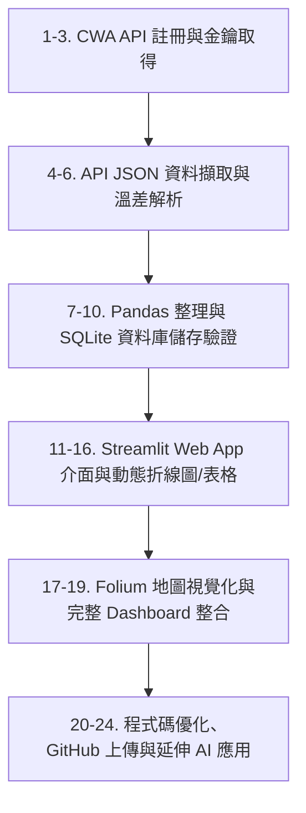

# ☀️ AI 創新微課程：Taiwan Weather Forecast 互動式天氣預報 Web App

> **從氣象資料到互動式天氣預報應用**  
> *用程式探索天氣 · 用資料看見台灣 · 用 AI 實現更多可能*  
> **Code Smarter, Build a Better Tomorrow!**


---

## 📌 專案簡介 (Project Overview)

本專案為 **AI 創新微課程 (AIoT L3 CWA HW1)** 之實作成果。專案核心目標是透過 **中央氣象署 (CWA) Open Data API** 取得台灣各地區氣象觀測與預報資料，利用 Python 進行 JSON 資料結構解析與 Pandas 資料處理，將清理後的每日最高與最低氣溫儲存至 **SQLite 資料庫**。最後結合 **Streamlit** 框架與 **Folium** 地理資訊圖表，打造出全互動式的 **Taiwan Weather Dashboard**。

---

## 🛠️ 技術棧與工具 (Tech Stack)

| 類別 | 技術 / 工具 | 說明 |
| :--- | :--- | :--- |
| **資料來源** | `CWA Open Data API` | 中央氣象署開放資料平台 (JSON 格式) |
| **程式語言** | `Python 3.9+` | 主要開發語言 |
| **資料擷取** | `Requests` | HTTP API Request 請求發送與 JSON 處理 |
| **資料整理** | `Pandas` | 資料結構化處理與統計分析 |
| **資料庫儲存**| `SQLite3` | 輕量級關聯式資料庫 (`data.db`) |
| **前端 Web App**| `Streamlit` | 快速建構互動式氣象 Web 儀表板 |
| **地圖視覺化** | `Folium` / `streamlit-folium` | 台灣各區分級溫標地圖互動展示 |
| **版本控制** | `Git` / `GitHub` | 專案版控與雲端庫連結 |

---

## 🗺️ 學習地圖與專案模組 (Learning Roadmap & Modules)

本專案依照 24 個標準實作步驟循序漸進建構：



### 📋 24 大核心單元細節

| 序號 | 模組主題 | 核心內容與技術要點 |
| :---: | :--- | :--- |
| **01** | **課程介紹** | 課程目標、學習地圖與專案成果展示 |
| **02** | **台灣的天氣與生活** | 天氣對生活決策的影響與智慧應用案例 |
| **03** | **中央氣象署 CWA Open Data** | 註冊 CWA 帳號、取得 API Key 並選擇目標預報資料集 |
| **04** | **API 資料取得** | 使用 Python `requests` 帶入 Authorization Header 取得 JSON 資料 |
| **05** | **JSON 資料結構解析** | 解析 `locations` -> `locationName` -> `weatherElement` (MinT, MaxT) 階層 |
| **06** | **提取最高與最低氣溫** | 擷取各區域每日最高溫 (`MaxT`) 與最低溫 (`MinT`) |
| **07** | **資料整理與預覽** | 使用 `Pandas` 將資料轉換為 DataFrame 並進行結構預覽 |
| **08** | **建立 SQLite 資料庫** | 建立 `data.db` 資料庫、設計 Schema 並自動導入氣溫資料 |
| **09** | **資料庫 Schema 設計** | 建立 `TemperatureForecasts` 資料表規畫 |
| **10** | **查詢資料驗證** |撰寫 SQL 語法 (`SELECT DISTINCT`, `WHERE`) 檢查並驗證寫入品質 |
| **11** | **Streamlit 入門** | 建立 Streamlit 基礎運行環境與 Hello World App |
| **12** | **從資料庫讀取資料** | 使用 `sqlite3` 與 `pd.read_sql_query` 連接資料庫查詢最新預報 |
| **13** | **下拉選單選擇地區** | 設計互動式下拉選單（北部、中部、南部、東北部、東部、東南部） |
| **14** | **繪製折線圖** | 使用圖表套件呈現選定地區一週最高/最低氣溫變化趨勢 |
| **15** | **顯示資料表格** | 清晰表格化呈現在地一週預報細節數據 |
| **16** | **整合 Web App 介面** | 結合區域選擇、氣溫趨勢圖與明細數據之天氣預報應用 |
| **17** | **進階：台灣地圖視覺化**| 整合 `Folium` 依據氣溫區間 (＜20°C, 20-25°C, 25-30°C, ＞30°C) 著色展示 |
| **18** | **選擇日期顯示地圖** | 增加日期動態選擇器，呈現指定日期全台各地區溫差狀況 |
| **19** | **完整成果展示** | 打造完整的 Taiwan Weather Dashboard 儀表板 |
| **20** | **程式碼品質與優化** | 模組化重構、例外處理 (Exception Handling)、避免重複插入機制 (UPSERT) |
| **21** | **專案上傳至 GitHub** | 設定 Remote 連結、版本控管、Commit & Push 至 GitHub 倉庫 |
| **22** | **延伸應用與想法** | 天氣提醒 Line Bot、旅遊行程建議、農業/防災應用與結合 AI 智慧分析 |
| **23** | **回顧與重點整理** | API 擷取、資料分析、DB 儲存到 Streamlit Web App 完整流程復盤 |
| **24** | **下一步：繼續探索** | 串接更多政府公開資料 API，運用 AI 輔助開發打造實務作品 |

---

## 💾 資料庫設計 (Database Schema)

資料庫檔名：`data.db`  
資料表名稱：`TemperatureForecasts`

```sql
CREATE TABLE IF NOT EXISTS TemperatureForecasts (
    id INTEGER PRIMARY KEY AUTOINCREMENT,
    regionName TEXT NOT NULL,
    dataDate TEXT NOT NULL,
    minT REAL NOT NULL,
    maxT REAL NOT NULL
);
```

### 驗證 SQL 查詢範例

```sql
-- 查詢所有地區名稱
SELECT DISTINCT regionName FROM TemperatureForecasts;

-- 查詢指定地區（如：中部地區）之氣溫預報
SELECT * FROM TemperatureForecasts 
WHERE regionName = '中部地區' 
ORDER BY dataDate ASC;
```

---

## 📂 專案目錄結構 (Project Structure)

```text
L3 WAC/
├── data/
│   └── data.db                 # SQLite 氣溫資料庫
├── src/
│   ├── fetch_cwa_data.py       # CWA API 抓取與 JSON 解析模組
│   ├── db_manager.py           # SQLite 資料庫建立與 SQL 操作模組
│   └── map_visualizer.py       # Folium 地圖繪製輔助模組
├── app.py                      # Streamlit Web App 主程式
├── .env.example                # API Key 環境變數範本
├── .gitignore                  # Git 忽略檔案設定
├── requirements.txt            # Python 依賴套件清單
└── README.md                   # 專案說明文件
```

---

## 🚀 快速開始 (Quick Start)

### 1. 克隆專案 (Clone Repository)

```bash
git clone https://github.com/Lannjiarong/AIoT_L3_CWA_HW1.git
cd AIoT_L3_CWA_HW1
```

### 2. 安裝依賴套件 (Install Dependencies)

```bash
pip install -r requirements.txt
```

*`requirements.txt` 需包含：*
```text
requests
pandas
streamlit
folium
streamlit-folium
python-dotenv
```

### 3. 設定 CWA API Key

於根目錄建立 `.env` 檔案並填入您的 API Key：
```env
CWA_API_KEY=YOUR_CWA_OPEN_DATA_API_KEY
```

### 4. 執行資料擷取與資料庫更新 (Fetch Data & Store)

```bash
python src/fetch_cwa_data.py
```

### 5. 啟動 Streamlit 氣象預報 Web App

```bash
streamlit run app.py
```

開啟瀏覽器造訪 `http://localhost:8501` 即可瀏覽互動式儀表板。

---

## 💡 延伸應用與未來展望 (Future Enhancements)

- [ ] **Line Bot 氣象提醒**：自動推播每日早晚溫差提示與降雨機率。
- [ ] **智慧旅遊推薦**：結合 OpenAI / Claude API 依據天氣預報生成適合的旅遊景點規劃。
- [ ] **農業/防災警示**：高溫極端天氣告警與農作物預防寒害提醒。

---

## 👨‍🏫 導師與致謝 (Credits)

- **課程名稱**：AI 創新微課程 - Taiwan Weather Forecast
- **指導講師**：煥哥 (Huan-Ge)
- **信念宣言**：
  > *"技術可以解決問題，但更重要的是用技術創造更好的未來！"*  
  > *—— Learn Today, Build Tomorrow | AI for Learning, AI for a Better Taiwan*
